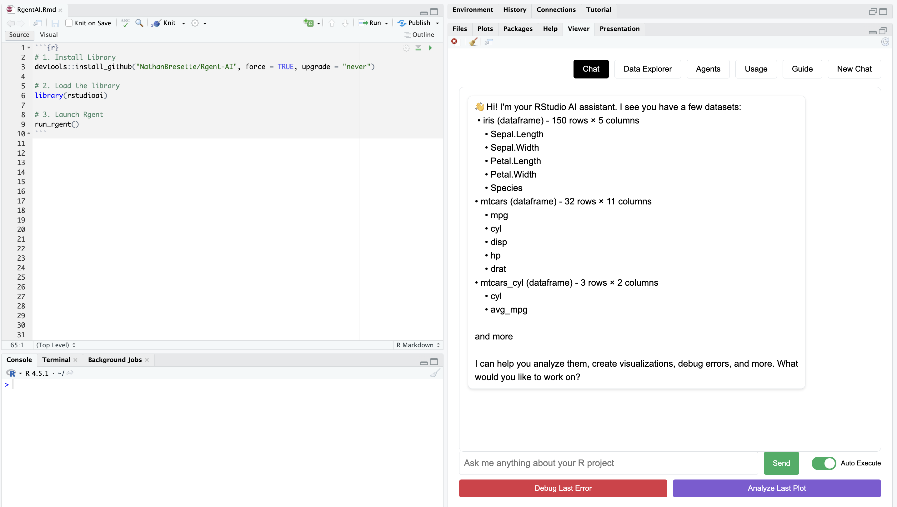
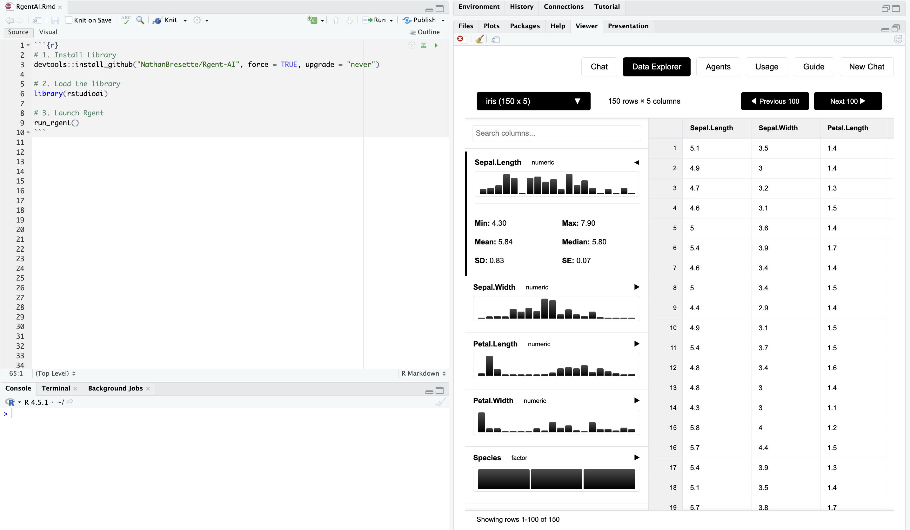
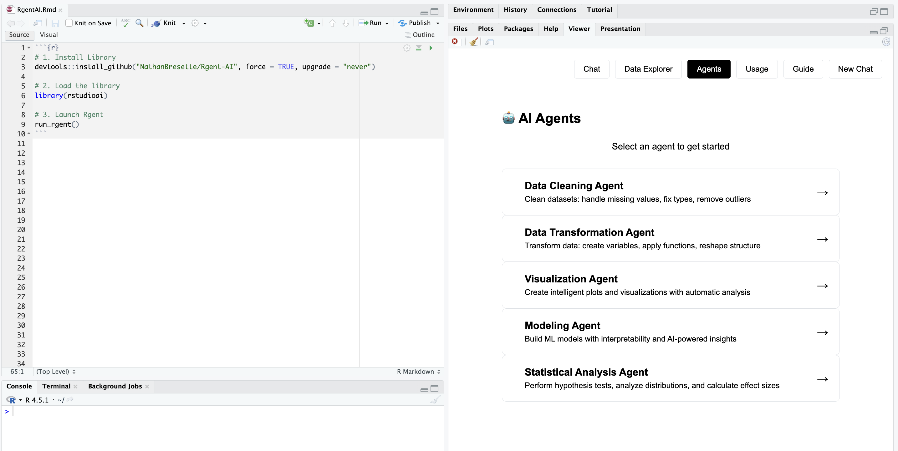

# RgentAI

AI-powered assistant for RStudio that provides context-aware code help, debugging, and specialized agents for data science workflows.

## Installation

```r
# Install from GitHub
if (!require(devtools)) install.packages("devtools")
devtools::install_github("NathanBresette/rstudioai")

# Load the package
library(rstudioai)

# Rgent will auto-start in RStudio, or launch manually:
run_rgent()
```

## Features

### Context-Aware AI Chat



Get instant AI assistance that understands your entire R project, including variables, functions, and data structures. Features include:

- Context-aware code generation
- Self-correcting code execution
- One-click debugging for the last error
- Plot analysis and visualization interpretation

### Data Explorer



Interactive tool for exploring and understanding your datasets:

- Browse, sort, and filter data with intuitive tables
- Instant summary statistics and data quality insights
- Quick visualizations to understand data distribution
- Column analysis with type detection and pattern recognition

### Specialized AI Agents



Automated workflows for common data science tasks:

- **Data Cleaning Agent**: Automated preprocessing and quality improvements
- **Transformation Agent**: Data transformations and feature creation
- **Statistical Analysis Agent**: Comprehensive testing with intelligent test selection
- **Modeling Agent**: Machine learning with model interpretability
- **Visualization Agent**: Creates and analyzes data visualizations

### Additional Features

- Real-time streaming responses
- Copy and insert code directly into RStudio editor
- Multi-model support (Claude Haiku for speed, Sonnet for complex tasks)
- Automatic updates
- Secure API with zero-data retention

## Requirements

- R >= 4.0.0
- RStudio (recommended)
- Internet connection
- Access code (get started at [rgentai.com](https://rgentai.com))

## Quick Start

After installation, Rgent will automatically start when you load the package in RStudio. The interface opens in RStudio's viewer pane. Start chatting or select an agent from the sidebar.

## Documentation

```r
# Package help
?rstudioai

# Function documentation
?run_rgent
?auto_start_rgent
```

## License

MIT License - see [LICENSE](LICENSE) file for details.

## Citation

If you use RgentAI in your research:

```bibtex
@software{bresette2024rgentai,
  title={RgentAI: AI-Powered Statistical Analysis Assistant for R},
  author={Bresette, Nathan},
  year={2024},
  url={https://github.com/NathanBresette/rstudioai}
}
```
